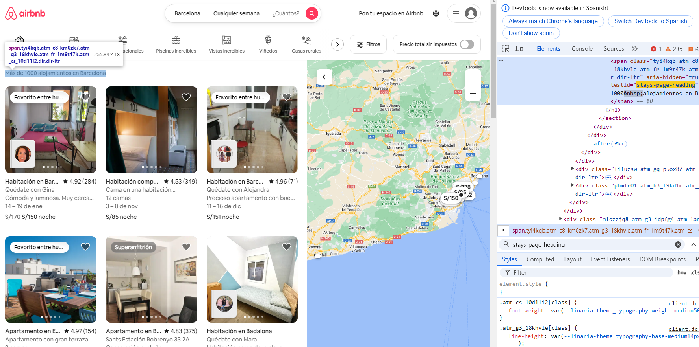
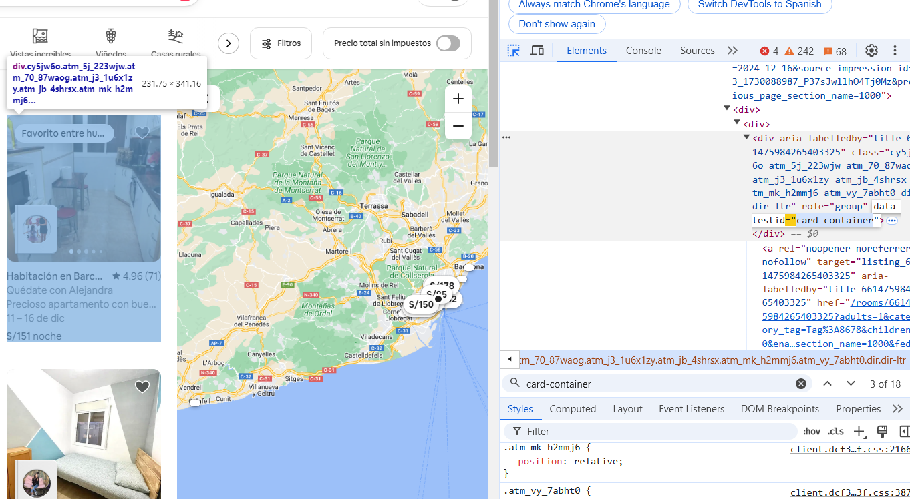
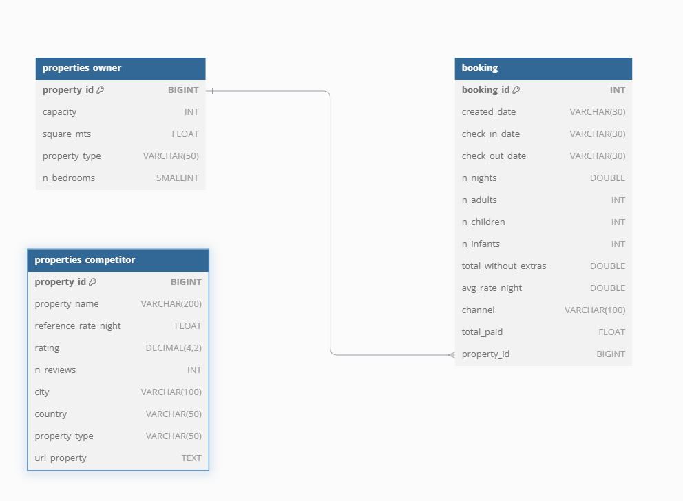

# Prueba técnica - Data Engineer JR

## Configuraciones previas
Empezaré implementando mi ambiente llamado `env` más la definición de los requerimientos.

```cmd
py -3.12 -m venv env
env\Scripts\activate

pip install selenium numpy pandas requests robotframework robotframework-seleniumlibrary

pip install google-cloud-bigquery google-auth pandas-gbq

pip install pymysql python-decouple

pip install lxml
```

Para este ejercicios haré uso de Selenium, por lo tanto, descargaré el [Chromedriver](https://googlechromelabs.github.io/chrome-for-testing/). Lo guardaré en la carpeta C:/windows , de esta manera selenium lo reconocerá por defecto


## Ejercicio 1: Scrapping sobre una página de propiedades vacaciones (Airbnb)

Para este ejercicio utilizaré la plataforma de airbnb y los siguientes conceptos/tecnologías.

- Selenium: Me permitirá manejar contenido dinámico (javacript y frameworks), así como la paginación de URLs dinámicas.
- xpath: Manera de obtener los elementos por el DOM de la plataforma, así como la chance de encontrar esos elementos por la consola de la plataforma
- Chromedriver: Driver que me permitirá interactuar con la plataform y extraer los datos.
- Librerias Python (pandas, decouple, etc)

> **Plus**:
     Haré una muestra de como se puede utilizar RobotFramework, da mayor facilidad en interacción con la plataforma utilizando selenium internamente

### Identificación de patrones

1. **Input y botón de ingreso al lugar**

`xpath = "//input[@id = 'bigsearch-query-location-input']"`


`xpath = "//button[@data-testid = 'structured-search-input-search-button']"`


2. **Pantallas de espera**

Suele pasar que el contenido toma tiempo en cargarse por completo, por eso se toma elementos estratégicos, que permita esperar dicha carga.

`xpath = "//span[@data-testid = 'stays-page-heading']"`



3. **Paginación**

La plataforma de airbnb no cuenta con una URL parametrizada que nos indique el número de paginación de resultados. Para este caso encontré el `nav` de la parte inferior, capturé todas las paginaciones visibles, con el fin de hacer click uno tras otro. Pero para eso tuve que capturar el penúltimo elemento para obtener la paginación máxima, y con ese número máximo pude iterar sobre las páginas. 

`xpath = "//nav[@aria-label='Paginación de los resultados de búsqueda']/div"`
```python
 max_paginacion = driver.find_element(By.XPATH, f"{base_paginacion}/*[{count_nav_paginacion}-1]").text
 for page_i in range(1, int(max_paginacion) + 1):
    ...
```


Cabe resaltar que cada número de la paginación, era un elemento `a`, así que no había complicaciones al hacerle click


4. **Iterando sobre propiedades**

Cada paginación contaba con 18 propiedades, en el zoom por defecto.
Cada elemento tenía como patrón `xpath = "//div[@data-testid='card-container']"`, lo que hice fue tomar la cantidad de coincidencias = 18, para posterior iterar hasta ese número

```python
count_properties = len(driver.find_elements(By.XPATH, properties_paginacion)) for propiedad_i in range(1, count_properties + 1):
    ...
```

Posterior a eso se hacía fácil capturar por indexación cada propiedad

```python
count_properties = len(driver.find_elements(By.XPATH, properties_paginacion))
for propiedad_i in range(1, count_properties + 1):
    card_propiedad = f"({properties_paginacion})[{propiedad_i}]"
    ...
```



5. **Captura de datos**

**Puntuación y Número de reseñas**

Este dato es especial, puede aparecer como `novedad, float, vacío`. Por eso tuve que realizar validaciones a la hora de capturarlo

`xpath = "{paginacion_i}/div/div[2]/div[last()]/span/span[last()]`


Si es que no se encontraba presente, trataba dicho valor como -1 y el número de reseñas como 0, en el caso aparezca 'novedad' el valor sería 0 y el número de reseñas también.

Cabe resaltar que tuve que utilizar regex, para poder identificar si realmente se encontraba el rating pero el patrón era simplemente como 4.25 (300) = `"(.*)\((\d+)\)"`

```python
    try:
        WebDriverWait(driver, 2.5).until(
            EC.presence_of_element_located((By.XPATH, f"{base_ind_paginacion}/div/div[2]/div[last()]/span/span[last()]"))
        )
        texto_puntuacion = driver.find_element(By.XPATH, f"{base_ind_paginacion}/div/div[2]/div[last()]/span/span[last()]").text
        search_puntuacion = re.search(r"(.*)\((\d+)\)", texto_puntuacion)
        if search_puntuacion:
            puntuacion = search_puntuacion.group(1).strip()
            nro_reseñas = search_puntuacion.group(2)
        else:
            puntuacion = 0
            nro_reseñas = 0
    except:
        puntuacion = -1
        nro_reseñas = 0
```

Vemos aquí que no existe rating


**Nombre propiedad**
Contaba con un patrón, pero se tenía que escarbar sobre elementos hijos div de un elemento padre identificable

`xpath = "{paginacion_i}/div/div[2]/div[1]"`

``` python
nombre_propiedad = driver.find_element(By.XPATH, f"{base_ind_paginacion}/div/div[2]/div[1]").text
```


**Tipo de propiedad**

Según los filtros de la plataforma encontré las siguientes categorías habitación|apartamento|casa|suite|alojamiento , lo que hice fue aplicar regex sobre el `nombre de propiedad`, para así reconocer su tipo, y si aparecía algo desconocido se categorizaba como no reconocido.

``` python
text_propiedad = re.search(r"(habitación|apartamento|casa|suite|alojamiento)", nombre_propiedad, re.IGNORECASE)
    tipo_propiedad = text_propiedad.group(1) if text_propiedad else "No reconocido"
```

**Precio por noche**
Este dato es variable, ya que puede que aparezca un único precio, o talves dos precios, donde uno de ellos está tachado. Lo que hice fue identificar todos los elementos que puedan contenerse en la fila donde se ubica el precio.
Luego por indexación = -1, capturar el penúltimo elemento, ya que esto sería el precio real por noche.

``` python
text_noche = driver.find_element(By.XPATH, f"{base_ind_paginacion}/div/div[2]/div[@data-testid='price-availability-row']//span/div/span[last()-1]").text
precio_noche = re.sub(r"[^0-9\.,]", "", text_noche)
```


**Url de propiedad**

Cuando se ingresa al elemento card de la propiedad, podemos obtener más datos que podrían relevante para nosotros más adelante. Así que ví oportuno extraer la URL de cada propiedad.

`xpath = "(//div[@data-testid='card-container'])[indice]/a"`

``` python
url_propiedad = driver.find_element(By.XPATH, f"{base_ind_paginacion}/a").get_attribute("href")
# A la url podemos agregarle como parametro el tipo de moneda
url_propiedad = f"{url_propiedad}&currency={currency}"
```


**ID de propiedad**

Cada elemento card de una propiedad tenía un elemento que poseía el ID ROOM, entonces me posicioné y pude extraer ese atributo.

``` python
id_titulo_propiedad = driver.find_element(By.XPATH, f"(//div[@data-testid='card-container'])[indice]/div/div[2]/div[1]").get_attribute("id")
id_propiedad = id_titulo_propiedad.split('_')[1]
```


**Dirección de propiedad**
No lo aboré en este ejercicio. Pero encontré la forma.

Se debe ingresar a la página de la propiedad o la `URL de propiedad` que extraje. Pero necesita hacer scroll y un tiempo de espera para que se recargue el mapa. Y así poder encontrar una ubicación del lugar.

Aquí sale 0 coincidencias


Pero al hacer scroll, se visualiza el lugar localizado


## Ejercicio 2: Limpieza de datos

El [proceso completo](/analysis/eda.ipynb) y [diccionario de datos]((/analysis/etl.ipynb) )

Esquema que se siguió


Los pasos que se hicieron en la limpieza, son:
- Eliminación de registros duplicados y columnas no objetivas para posteriores análisis.
- Uniformidad en el nombre de columnas en los dataset.
- Unicidad en los valores de cada columna.
- Condicionales de reemplazo ante valores extraños en columnas como `nro_noches`, `precio_por_noche`, `pago_total`, etc.
- Formeteo de columnas a su tipo correcto (fechas, numeros, cadenas)
- Imtegridad en los datos, en Bookings.csv, existe registros de propiedad no existentes en Properties.csv, se procedió a borrarlos, para tener una mejor integración.

El archivo [etl.py](resources/etl.py), contiene modularizado el ETL por cada dataset. y se sintetizó los pasos mencionados arriba.


## Ejercicio 3: Almacenamientos de datos curados

Decidí realizarlo por base de datos, utilizando como librería y conexión `pymysql`, las funciones que me permiten hacer DML está en [database.py](config/database.py), [utils.py](config/utils.py)  y el script sql [aquí](sql/script.sql). 

Opté por el siguiente diagrana ER.




# Ejecución

El scrapping en modo headless(segundo plano), ETL y Guardado en Base de Datos se ejecutan en [main.py](main.py)

Requisitos:
- Tener Mysql Server, y ejecutar el [script.sql](sql/script.sql)
- Tener guardado el chromediver en C:/windows
- Tener un nivel más de arriba de la carpeta raíz un archivo `.env`, esto captura datos sensibles, como los parametros de conexión de la BD:

```env
SERVER_MYSQL = 127.0.0.1
DATABASE_MYSQL= BD_STAY_UNIQUE
USERNAME_MYSQL= root
PASSWORD_MYSQL= Mi..3
GOOGLE_APPLICATION_CREDENTIALS = keys/avid-task...-14beb14dbeb6.json
GCP_PROJECT_ID = 1091...73
```
- Tener python un ambiente de python 3.12 y ejecutar el [requirements.txt](requirements.txt)

Dado los requisitos se podría ejecutar el main.py, hubiera sido más practico disponer una imagen de docker. Pero por el momento no fue posible. Muchas Gracias.